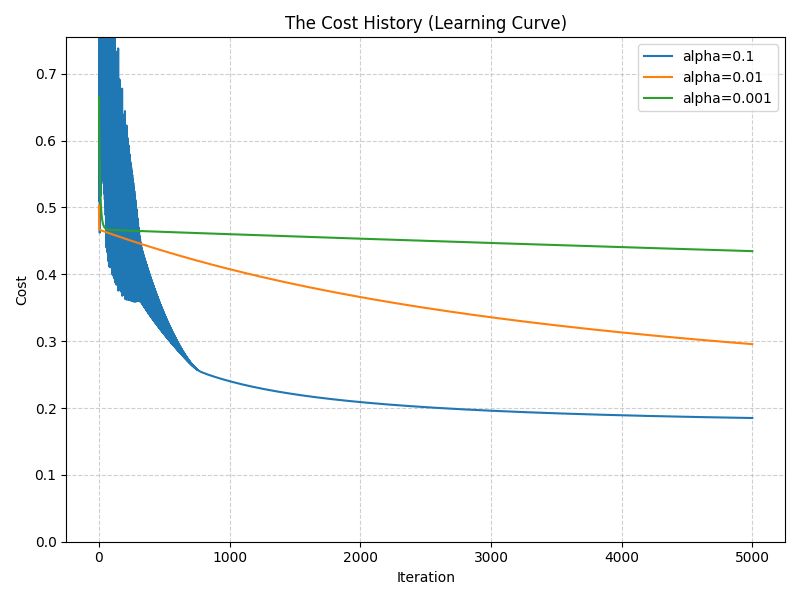
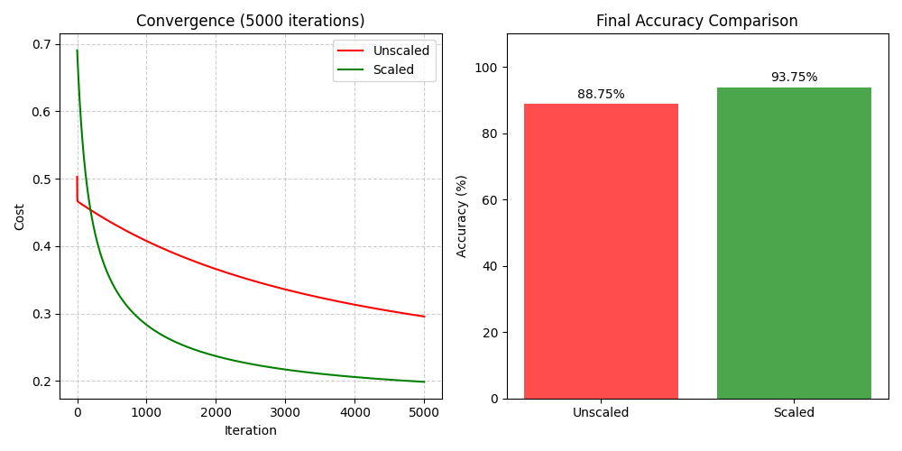
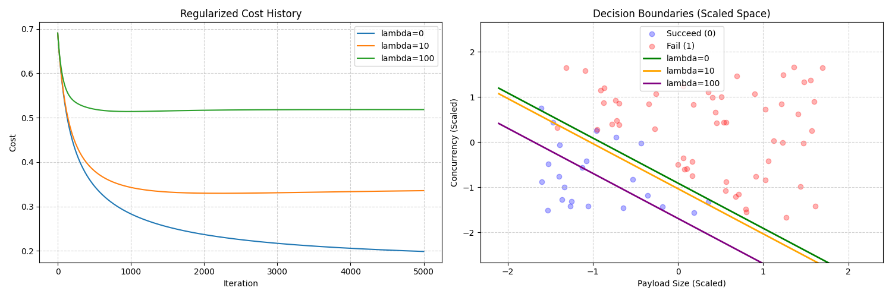
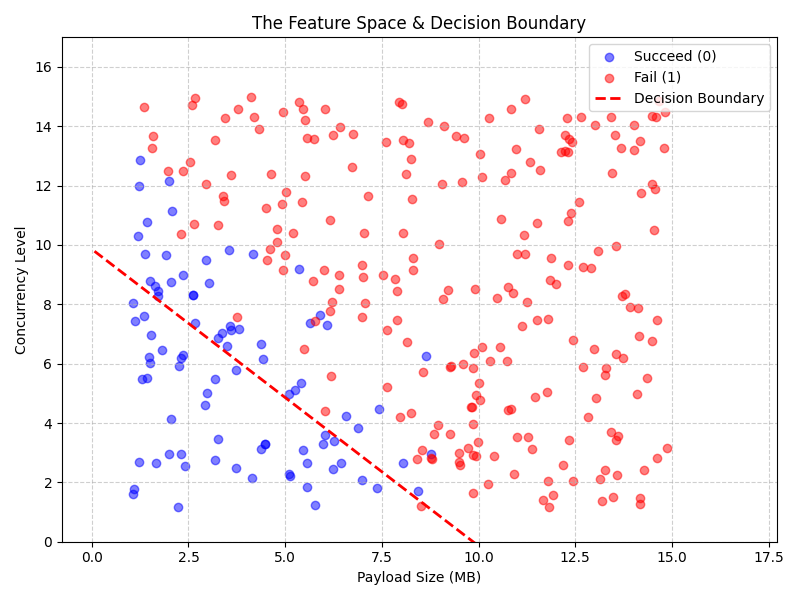
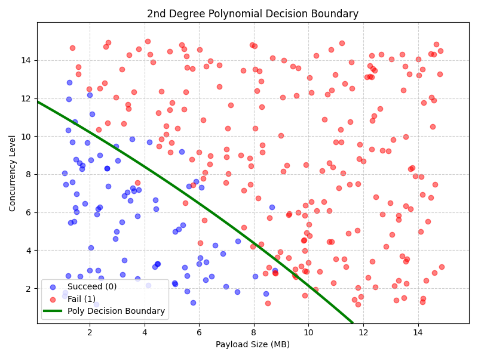

# API Timeout Predictor: Logistic Regression from Scratch

## About This Project
In modern ML engineering, relying solely on abstracted frameworks like scikit-learn can obscure the mechanical realities of the algorithms we deploy. This project serves as a technical portfolio piece demonstrating a deep, foundational understanding of machine learning mathematics and algorithm design.

By building a Logistic Regression model entirely from scratch using raw NumPy, this repository tackles a highly relevant software engineering problem: predicting backend API timeouts based on payload and concurrency constraints. It showcases the end-to-end implementation of custom gradient descent, rigorous feature scaling, L2 regularization, and polynomial feature mapping to solve non-linear classification problems in system architecture.

## 🌍 The Real-World Problem
In modern backend architecture, API endpoints often fail or "timeout" under heavy load. This project models a real-world scenario where an API's success or failure depends on two primary factors:
1. **Payload Size (MB):** The amount of data being processed or transferred.
2. **Concurrency Level:** The number of simultaneous requests hitting the server.

When both payload and concurrency are low, the API easily succeeds. However, as they increase, the server's resources are strained, leading to timeouts. This project builds a **Logistic Regression model from scratch** (using raw NumPy) to predict whether an API request will Succeed (0) or Fail (1) based on these two features. I developed this project to deepen my understanding of **Gradient Descent**, **Feature Engineering**, and the underlying math of **Regression Models**.

## 💻 Main Parts of the Code
The implementation deliberately avoids high-level ML libraries like `scikit-learn` to demonstrate the inner math and mechanics of machine learning:
- **Data Generation & Split:** Synthetically generates 400 realistic data points with added Gaussian noise to simulate real-world ambiguity, then rigorously splits it 80/20 to prevent data leakage.
- **Sigmoid & Prediction:** The core logistic function that maps linear combinations of features to a probability between 0 and 1.
  - `sigmoid(z) = 1 / (1 + exp(-z))`
  - `prediction(X, w, b) = sigmoid(X · w + b)`
- **Cost Function (Binary Cross-Entropy):** Calculates the error of our predictions. It includes mathematical safeguards (`np.clip`) to prevent `log(0)` explosion.
  - `calculate_loss = -y * log(pred) - (1 - y) * log(1 - pred)`
  - `calculate_cost (J) = (1 / m) * Σ calculate_loss`
- **Gradient Descent:** The optimization algorithm that iteratively updates weights (`w`) and bias (`b`) to minimize the cost.
  - `dj_dw = (1 / m) * Σ (prediction - y) * X`
  - `dj_db = (1 / m) * Σ (prediction - y)`
  - `w = w - alpha * dj_dw`
  - `b = b - alpha * dj_db`
- **Feature Scaling (Z-Score Standardization):** Centers and scales the data. The parameters (μ, σ) are calculated *only* on the training set and applied to the test set to avoid leakage.
  - `X_scaled = (X - mu) / sigma`
- **L2 Regularization (Ridge):** Adds a penalty for large weights to prevent the model from overfitting to the training noise.
  - `regularized_cost = J + (lambda_ / (2 * m)) * Σ w²`
  - `dj_dw_regularized = dj_dw + (lambda_ / m) * w`
- **Polynomial Feature Mapping:** Expands the 2D feature space into 5D (adding squares and interactions) to allow the model to learn curved, non-linear boundaries.
  - `X_poly = [x1, x2, x1², x2², x1*x2]`

## 🏆 Best Performing Model
After extensive hyperparameter tuning and feature engineering, the following configuration was identified as the most robust and accurate:

- **Algorithm:** 2nd-Degree Polynomial Logistic Regression
- **Scaling:** Z-Score Standardization (Training-set based)
- **Learning Rate (α):** 0.01
- **Regularization (λ):** 10 (Moderate penalty)
- **Iterations:** 5,000 - 10,000
- **Peak Performance:** ~93.75% Test Accuracy

**Why this model?** The 2nd-degree polynomial terms allow the model to handle the natural curvature of system stress limits, while moderate regularization ensures it doesn't overfit to the random noise generated by network latency or transient server spikes.

## 📊 Visualizations and Insights

### 1. The Cost History (Learning Curve)

**Insight:** This plot demonstrates how the cost (error) decreases over time for different learning rates (α). It proves that selecting an optimal α is a balance between speed (high α) and stability (lower α).

### 2. Feature Scaling Comparison

**Insight:** This side-by-side comparison shows the drastic impact of Feature Scaling. 
* **Unscaled Data:** The model struggles to converge, trailing at ~71% accuracy after initial training.
* **Scaled Data:** Reaches optimal accuracy (~93%) rapidly because the cost contour becomes circular, allowing gradient descent to take direct paths to the minimum.

### 3. Regularization Comparison

**Insight:** Regularization controls model complexity by penalizing large weights (λ).
* λ = 0: Highly aggressive, potentially overfit.
* λ = 100: Overly restrictive, causing underfitting and dropping accuracy to ~83%.

### 4. Feature Space & Linear Decision Boundary

**Insight:** Plots the standard logistic regression boundary. While effective for simple separation, a strict straight line fails to capture the nuances of edge cases where payload and concurrency interact non-linearly.

### 5. Non-Linear (Polynomial) Decision Boundary

**Insight:** By engineering 2nd-degree polynomial features, the model learns a curved boundary.
* *Conclusion:* This flexibility allows the model to "wrap" around successful request clusters, making it far more robust to complex data patterns than a strict linear model.

## 🚀 Final Conclusion
This project validates that predicting system failures can be modeled mathematically. By building the pipeline from scratch, we confirmed that **scaling is mandatory**, **regularization is essential for generalization**, and **polynomial feature engineering** is the bridge between a simple linear classifier and a high-performance system predictor.

---
### 🛠️ Installation & Usage
To run the project locally, follow these steps:

1. **Clone the repository:**
   ```bash
   git clone <https://github.com/moustafa-ash/API-Timeout-Predictor>
   cd "API Timeout Predictor"
   ```

2. **Set up a Virtual Environment:**
   ```bash
   python -m venv .venv
   ```

3. **Activate the Environment:**
   * **Windows:** `.venv\Scripts\activate`
   * **macOS/Linux:** `source .venv/bin/activate`

4. **Install Dependencies:**
   ```bash
   pip install -r requirements.txt
   ```

5. **Execute the Simulation:**
   ```bash
   python main.py
   ```
